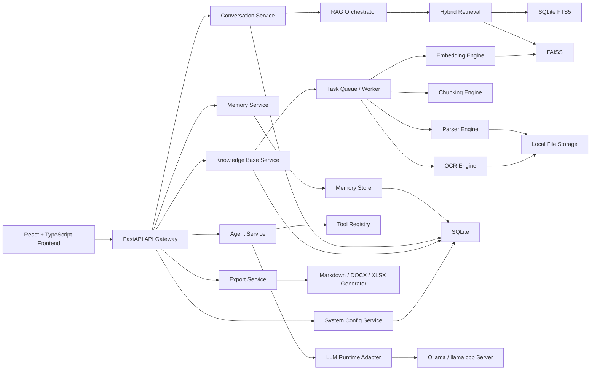

**项目名称**
- `端侧本地大模型 RAG + Agent 服务`
- 文档版本：`V1.0`
- 文档用途：作为项目立项、架构评审、研发实施、迭代扩展和交付验收的统一设计基线
- 适用阶段：
- `Phase 1` 首版落地、
- `Phase 2` 能力增强、
- `Phase 3` 桌面化与安全增强

**一、建设目标**
- 面向个人笔记本场景，建设一套`全本地运行`、`可离线使用`、`支持多格式文档处理`、`具备本地 RAG 与部分 Agent/记忆能力`的智能知识服务系统
- 前端采用 `React + TypeScript`，后端采用 `Python + FastAPI`
- 支持用户上传 `Excel / Word / PDF / PPT / 图片` 文件，支持 `OCR`
- 支持问答、知识库检索、长期记忆、导出 `Markdown / Word / Excel`
- 支持中英文双语，具备可扩展的模型运行时与工具调用框架
- 设计目标不是一次性堆满能力，而是形成`可迭代、可扩展、可验证`的工程底座

**二、范围定义**
- `一期范围`
  - 本地 Web 版
  - 文档上传、解析、OCR、向量化、知识库管理
  - RAG 问答、引用溯源、会话管理
  - Markdown / Word / Excel 导出
  - 中英文双语
- `二期范围`
  - 混合检索、轻量重排、长期记忆管理
  - Hermes 风格 Agent 工具调用
  - 更细粒度权限控制、任务中心、运行监控
- `三期范围`
  - 桌面应用封装
  - 数据加密、模型管理增强、老格式 Office 兼容增强


**三、总体架构**
- 系统采用`前后端分离 + 本地 AI 推理 + 本地存储`架构
- 设计分为六层：`表现层`、`接口层`、`业务服务层`、`AI 能力层`、`任务编排层`、`本地存储层`
- 所有核心数据默认保留在本地磁盘
- 模型运行时、Embedding、OCR、向量库、数据库均采用可替换适配器，避免后续被单一技术栈锁死

**四、系统架构图说明**
- 前端负责上传、会话交互、知识库管理、Agent 可视化执行过程、导出与系统设置
- FastAPI 作为统一 API 层，对外提供 REST 接口与 SSE 流式接口
- 任务中心负责文件解析、OCR、切块、向量化、导出等异步任务
- 核心业务服务包括文档处理服务、RAG 服务、Agent 服务、记忆服务、导出服务、系统配置服务
- AI 层包括本地 LLM 运行时、Embedding 模型、OCR 引擎、可选 Rerank 模型
- 数据层由本地文件系统、SQLite、FAISS 构成，分别承载原始文件、结构化数据、向量数据



**五、部署架构说明**
- `推荐首发形态`：本地 Web 服务模式
- 启动方式：本地启动 Python 服务，前端静态资源由同服务托管，用户通过浏览器访问 `http://127.0.0.1:<port>`
- `后续扩展形态`：桌面壳封装模式
- 桌面模式建议在 Web 版稳定后评估 `Electron` 或 `Tauri + Python sidecar`
- 模型默认不内嵌到安装包，采用首次启动引导下载或检测本机运行时
- 本地存储建议统一放在用户目录下的应用专属目录，便于备份与迁移

**六、模块划分**
- `1. 前端应用模块`
  - 会话中心
  - 知识库管理
  - 文件上传与预览
  - Agent 任务面板
  - 记忆中心
  - 导出中心
  - 系统设置与语言切换
- `2. API 网关模块`
  - 路由汇总
  - 请求校验
  - 统一响应格式
  - SSE 流式输出
  - 错误码映射
- `3. 文档处理模块`
  - 文件接收
  - 类型识别
  - 文本提取
  - OCR 识别
  - 清洗标准化
  - 结构化切块
  - 向量化入库
- `4. RAG 模块`
  - 查询改写
  - 混合检索
  - 轻量重排
  - Prompt 组装
  - 引用溯源
  - 回答生成
- `5. Agent 模块`
  - 工具注册与工具描述
  - 多轮工具调用编排
  - 执行状态回传
  - 工具权限控制
  - 结果归档
- `6. 记忆模块`
  - 短期会话记忆
  - 长期用户偏好记忆
  - 长期事实记忆
  - 自动摘要与记忆提取
  - 记忆管理与清理
- `7. 导出模块`
  - 会话导出
  - 检索结果导出
  - Agent 执行报告导出
  - Markdown / DOCX 生成
- `8. 基础设施模块`
  - 配置管理
  - 任务队列
  - 模型适配器
  - 日志与诊断
  - 本地权限边界
  - 多语言资源管理

**七、核心设计原则**
- `本地优先`：核心数据与推理能力均支持脱网运行
- `模块解耦`：模型运行时、OCR、向量库、检索策略均可替换
- `先稳后全`：先保证主链路跑通，再逐步增强 Agent 与记忆能力
- `可追溯`：每次回答尽可能给出来源、任务状态和处理日志
- `可控安全`：对文件系统、记忆写入、联网行为进行显式控制

**八、核心业务流程**
- `1. 文件入库流程`
  - 用户上传文件
  - 后端创建上传记录与解析任务
  - 解析器按文件类型提取文本
  - 文本不足时触发 OCR
  - 进行清洗、结构切块、元数据绑定
  - 生成向量并写入向量索引
  - 更新 SQLite 中文件、任务、分块状态
- `2. RAG 问答流程`
  - 用户输入问题
  - 系统判断是否启用知识库和记忆
  - 执行查询改写与混合召回
  - 可选轻量重排
  - 组装 Prompt 并调用本地模型
  - 通过 SSE 流式返回回答
  - 保存会话与引用结果
- `3. Agent 执行流程`
  - 用户开启 Agent 模式
  - 加载工具集和系统 Prompt
  - 模型生成工具调用请求
  - 服务端执行工具并返回结果
  - 多轮循环直到生成最终答复
  - 保存执行链路与工具调用日志
- `4. 记忆处理流程`
  - 对话结束后触发记忆提取策略
  - 高置信信息进入候选记忆
  - 根据配置自动写入或待用户确认
  - 后续对话时先检索相关长期记忆再补充上下文

**九、文件格式支持策略**
- `一期稳定支持`
  - `PDF`
  - `DOCX`
  - `XLSX`
  - `PPTX`
  - `PNG / JPG / JPEG / BMP / TIFF`
- `二期增强支持`
  - `DOC / XLS / PPT` 通过 `LibreOffice headless` 转换后处理
- `处理策略`
  - PDF 优先提取文本层，文本覆盖率低时再触发 OCR
  - Excel 按工作表、表头、数据区切块
  - PPT 按页面、标题、正文、备注切块
  - Word 按标题层级、段落、表格切块
  - 图片先做缩放、灰度化、去噪，再进行 OCR

**十、接口设计**
- 接口统一前缀：`/api/v1`
- 响应规范
  - 成功：`{ code: 0, message: "ok", data: ... }`
  - 失败：`{ code: <non-zero>, message: "...", error_detail: ... }`
- 鉴权策略
  - 首版默认单机单用户，可不做登录
  - 如需桌面壳保护，可增加本地访问令牌或应用级 PIN
- 流式协议
  - 对话与 Agent 输出使用 `SSE`
  - 任务进度可使用 `轮询 + SSE` 混合模式

**十一、接口清单**
- `1. 系统与配置`
  - `GET /system/info`：获取系统信息、模型运行时状态、版本信息
  - `GET /settings`：获取用户配置
  - `PUT /settings`：保存用户配置
  - `GET /languages`：获取支持语言列表
- `2. 文件与知识库`
  - `POST /knowledge-bases`：创建知识库
  - `GET /knowledge-bases`：获取知识库列表
  - `GET /knowledge-bases/{kb_id}`：获取知识库详情
  - `PUT /knowledge-bases/{kb_id}`：更新知识库
  - `DELETE /knowledge-bases/{kb_id}`：删除知识库
  - `POST /knowledge-bases/{kb_id}/files/upload`：上传文件
  - `GET /knowledge-bases/{kb_id}/files`：查询文件列表
  - `DELETE /knowledge-bases/{kb_id}/files/{file_id}`：删除文件
  - `POST /knowledge-bases/{kb_id}/reindex`：重建或增量重建索引
  - `GET /knowledge-bases/{kb_id}/chunks`：查看分块与元数据
- `3. 任务中心`
  - `GET /tasks`：获取任务列表
  - `GET /tasks/{task_id}`：获取任务详情
  - `POST /tasks/{task_id}/retry`：重试任务
  - `POST /tasks/{task_id}/cancel`：取消任务
- `4. 会话与问答`
  - `POST /chat/completions`：非流式问答
  - `POST /chat/stream`：流式问答
  - `GET /sessions`：获取会话列表
  - `POST /sessions`：创建会话
  - `GET /sessions/{session_id}`：获取会话详情
  - `PUT /sessions/{session_id}`：更新会话标题
  - `DELETE /sessions/{session_id}`：删除会话
- `5. Agent`
  - `POST /agent/stream`：Agent 流式执行
  - `GET /agent/tools`：获取可用工具列表
  - `GET /agent/runs/{run_id}`：获取执行记录
- `6. 记忆`
  - `GET /memories`：查询记忆
  - `POST /memories`：新增记忆
  - `PUT /memories/{memory_id}`：修改记忆
  - `DELETE /memories/{memory_id}`：删除记忆
  - `POST /memories/extract`：手动触发记忆提取
- `7. 导出`
  - `POST /exports/markdown`：导出 Markdown
  - `POST /exports/docx`：导出 Word
  - `POST /exports/xlsx`：导出 Excel
  - `GET /exports/{export_id}`：查询导出状态
  - `GET /exports/{export_id}/download`：下载导出文件

**十二、关键接口示例**
- `文件上传接口`

```http
POST /api/v1/knowledge-bases/{kb_id}/files/upload
Content-Type: multipart/form-data
```

```json
{
  "mode": "append",
  "enable_ocr": true,
  "language": "zh-CN"
}
```

```json
{
  "code": 0,
  "message": "ok",
  "data": {
    "upload_id": "upl_xxx",
    "task_ids": ["task_001", "task_002"]
  }
}
```

- `RAG 流式问答接口`

```http
POST /api/v1/chat/stream
Content-Type: application/json
Accept: text/event-stream
```

```json
{
  "session_id": "sess_001",
  "query": "请总结这个知识库里和端侧部署有关的内容",
  "language": "zh-CN",
  "rag_enabled": true,
  "agent_enabled": false,
  "knowledge_base_ids": ["kb_work"],
  "top_k": 6,
  "score_threshold": 0.35,
  "include_memory": true
}
```

- `SSE 事件建议`
  - `event: message_start`
  - `event: retrieval_result`
  - `event: token`
  - `event: citation`
  - `event: tool_call`
  - `event: tool_result`
  - `event: message_end`
  - `event: error`

- `Agent 执行接口`

```json
{
  "session_id": "sess_001",
  "task": "帮我整理知识库中的部署方案并导出为 markdown",
  "language": "zh-CN",
  "tools": [
    "knowledge_base_search",
    "memory_read",
    "export_markdown"
  ],
  "max_steps": 6,
  "require_user_confirm_for_write": true
}
```

**十三、数据库设计原则**
- 数据库采用 `SQLite`
- 文本检索采用 `SQLite FTS5`
- 向量索引采用 `FAISS`
- 文件本体保存在本地文件系统，数据库仅维护路径、状态、摘要与元数据
- 所有表建议带有 `created_at`、`updated_at`
- 删除策略分为`逻辑删除`和`物理删除`
- 为后续迁移到更强数据库保留字段规范和索引习惯

**十四、数据库表设计**
- `1. app_settings`
  - 用途：保存系统级配置和用户偏好
  - 关键字段：`id`、`language`、`theme`、`default_model`、`embedding_model`、`ocr_enabled`、`storage_root`、`web_search_enabled`
- `2. knowledge_bases`
  - 用途：知识库主表
  - 关键字段：`id`、`name`、`description`、`path`、`status`、`file_count`、`chunk_count`
- `3. documents`
  - 用途：上传文件主表
  - 关键字段：`id`、`kb_id`、`file_name`、`file_ext`、`mime_type`、`file_size`、`storage_path`、`sha256`、`parse_status`、`ocr_status`、`index_status`
- `4. document_versions`
  - 用途：记录文件版本与重复导入信息
  - 关键字段：`id`、`document_id`、`version_no`、`sha256`、`change_type`、`source_path`
- `5. parse_tasks`
  - 用途：解析、OCR、向量化、导出等异步任务
  - 关键字段：`id`、`task_type`、`related_id`、`status`、`progress`、`error_code`、`error_message`、`started_at`、`finished_at`
- `6. document_chunks`
  - 用途：保存切块与元数据
  - 关键字段：`id`、`document_id`、`kb_id`、`chunk_index`、`content`、`content_hash`、`page_no`、`sheet_name`、`slide_no`、`heading_path`、`token_count`、`vector_ref`
- `7. retrieval_logs`
  - 用途：记录检索行为与召回结果
  - 关键字段：`id`、`session_id`、`query_text`、`rewritten_query`、`retrieval_mode`、`top_k`、`hit_count`
- `8. retrieval_hits`
  - 用途：保存一次检索命中的明细
  - 关键字段：`id`、`retrieval_log_id`、`chunk_id`、`score`、`rank_no`、`source_type`
- `9. sessions`
  - 用途：会话主表
  - 关键字段：`id`、`title`、`mode`、`language`、`rag_enabled`、`agent_enabled`、`last_message_at`
- `10. messages`
  - 用途：会话消息表
  - 关键字段：`id`、`session_id`、`role`、`content`、`content_type`、`model_name`、`prompt_tokens`、`completion_tokens`、`status`
- `11. message_citations`
  - 用途：回答引用来源
  - 关键字段：`id`、`message_id`、`document_id`、`chunk_id`、`page_no`、`sheet_name`、`slide_no`、`quote_text`
- `12. agent_runs`
  - 用途：Agent 执行主表
  - 关键字段：`id`、`session_id`、`task_text`、`status`、`step_count`、`final_answer`
- `13. agent_steps`
  - 用途：Agent 每一步执行记录
  - 关键字段：`id`、`run_id`、`step_no`、`step_type`、`tool_name`、`tool_input`、`tool_output`、`status`
- `14. memories`
  - 用途：长期记忆主表
  - 关键字段：`id`、`memory_type`、`title`、`content`、`importance`、`confidence`、`write_mode`、`status`
- `15. memory_links`
  - 用途：记忆与会话/消息的关联
  - 关键字段：`id`、`memory_id`、`session_id`、`message_id`、`source_kind`
- `16. memory_vectors`
  - 用途：长期记忆向量索引映射
  - 关键字段：`id`、`memory_id`、`vector_ref`、`embedding_model`
- `17. exports`
  - 用途：导出任务主表
  - 关键字段：`id`、`export_type`、`source_type`、`source_id`、`file_name`、`file_path`、`status`
- `18. operation_logs`
  - 用途：重要操作审计
  - 关键字段：`id`、`module`、`action`、`target_id`、`result`、`detail`
- `19. model_registry`
  - 用途：已配置模型及运行参数
  - 关键字段：`id`、`model_name`、`runtime_type`、`model_path`、`quantization`、`context_length`、`is_default`
- `20. prompt_templates`
  - 用途：系统 Prompt、Agent Prompt、多语言模板
  - 关键字段：`id`、`template_key`、`language`、`scene`、`content`、`version_no`

**十五、核心索引建议**
- `documents(kb_id, parse_status, index_status)`
- `document_chunks(document_id, chunk_index)`
- `sessions(last_message_at)`
- `messages(session_id, created_at)`
- `agent_steps(run_id, step_no)`
- `memories(memory_type, status, importance)`
- `exports(status, created_at)`
- `retrieval_hits(retrieval_log_id, rank_no)`
- `documents(sha256)` 唯一索引，防止重复导入
- `app_settings(id)` 单行配置表

**十六、向量索引设计**
- 每个知识库独立维护一个向量索引文件
- 长期记忆单独维护记忆向量索引，避免和知识库语料混用
- 向量映射关系通过 `vector_ref` 与数据库分块/记忆表关联
- 删除文件时执行软删除标记并异步重建局部索引
- 初期建议使用 `FAISS IndexFlatIP` 或 `HNSW/IVF` 的简化配置，不要过早复杂化

**十七、技术选型最终表**

| 分类 | 最终选型 | 说明 |
|---|---|---|
| 前端框架 | React 18 + TypeScript + Vite | 研发效率高，构建快，适合桌面型前端 |
| UI 组件 | Ant Design 5 | 组件成熟，桌面后台风格适合该场景 |
| 状态管理 | Zustand | 轻量、维护成本低 |
| 服务端状态 | TanStack Query | 处理任务轮询、缓存与请求状态 |
| 路由 | React Router v6 | 成熟稳定 |
| 国际化 | react-i18next | 双语资源管理成熟 |
| 文件上传 | react-dropzone | 拖拽上传体验较好 |
| PDF 预览 | pdfjs-dist | 本地预览成熟方案 |
| DOCX 预览 | docx-preview | 满足轻量预览 |
| 表格预览 | xlsx / SheetJS | 适合 Excel 解析与预览 |
| 后端框架 | FastAPI | 异步性能好，文档能力强 |
| 数据校验 | Pydantic v2 | 与 FastAPI 适配好 |
| ORM | SQLModel 或 SQLAlchemy | 轻量且可控 |
| 数据库 | SQLite | 单机本地部署最合适 |
| 关键词检索 | SQLite FTS5 | 本地混合检索必需 |
| 向量库 | FAISS | 本地轻量高效 |
| PDF 解析 | PyMuPDF | 速度与兼容性较好 |
| Word 解析 | python-docx | 适合 docx |
| Excel 解析 | openpyxl + pandas | 兼容与导出能力较强 |
| PPT 解析 | python-pptx | 满足 pptx 文本提取 |
| 图像处理 | Pillow | OCR 前处理 |
| OCR 引擎 | RapidOCR / PaddleOCR ONNX | 本地 CPU 场景更友好 |
| 文档转换 | LibreOffice headless | 二期补充老格式 Office 支持 |
| LLM Runtime | Ollama + 可切换 llama.cpp server | 开发期稳定，后续可内嵌替换 |
| 主对话模型 | Qwen 系 3B/7B Instruct 量化版 | 中英文能力较均衡 |
| Embedding 模型 | bge-small-zh-v1.5 或 bge-m3 | 面向中英混合检索可扩展 |
| Rerank 模型 | 可选 bge-reranker-base 小型化版本 | 二期增强准确率 |
| 导出 Word | python-docx | 易于控制格式 |
| 导出 Excel | pandas + openpyxl | 适合多 sheet |
| 打包方式 | 首期本地 Web，后续 Electron/Tauri | 降低首发复杂度 |

**十八、模型与硬件建议**
- `最低建议`
  - CPU：4 核以上
  - 内存：16GB
  - 存储：至少 20GB 可用空间
- `推荐配置`
  - CPU：8 核以上
  - 内存：32GB
  - GPU：8GB 显存以上
- `模型建议`
  - 标准模式：`7B 量化模型`
  - 低配模式：`1.5B ~ 3B 量化模型`
  - Embedding 模型独立运行，避免和主模型抢占显存
- `运行策略`
  - 模型空闲自动卸载
  - 可配置上下文长度
  - 对大文档采用分批向量化

**十九、非功能性要求**
- `性能`
  - 普通问答首 token 时间目标：`2~8 秒`，受硬件影响
  - 千级文档块检索延迟目标：`< 100ms`
  - 文件上传与解析支持断点重试
- `稳定性`
  - 解析任务异常不影响主服务
  - 索引异常可重建
  - 模型不可用时能给出明确错误提示
- `可维护性`
  - 核心模块解耦
  - 错误码统一
  - 日志可检索
- `可观测性`
  - 展示任务进度、模型状态、索引状态、导出状态
- `安全性`
  - 默认禁用联网
  - 工具调用限制在白名单能力
  - 文件系统访问仅限应用工作区

**二十、Agent 设计边界**
- 首版 Agent 只开放安全工具，不开放任意命令执行
- 首批工具建议
  - `knowledge_base_search`
  - `memory_read`
  - `memory_write`
  - `calculator`
  - `export_markdown`
  - `export_docx`
  - `list_workspace_files`
- 工具调用控制
  - 最大步数限制
  - 超时限制
  - 用户确认开关
  - 调用日志记录
- 前端展示建议
  - 展示“工具调用”和“结果摘要”
  - 不展示不可控的完整内部推理文本

**二十一、记忆系统设计**
- `短期记忆`
  - 当前会话上下文
  - 历史消息摘要
- `长期记忆`
  - 用户偏好
  - 重要事实
  - 常用任务模板
- `写入策略`
  - 默认仅自动写入高置信偏好类记忆
  - 事实类记忆建议进入待确认区
- `遗忘策略`
  - 低重要度、长期未命中的记忆降低优先级
  - 用户可以手动编辑、归档、删除

**二十二、导出设计**
- `Markdown`
  - 适合会话、报告、知识总结
  - 保留标题层级、引用块、代码块、来源附录
- `Word`
  - 适合正式汇报、方案沉淀
  - 保留标题、表格、重点高亮、来源说明
- `Excel`
  - 适合导出文件列表、问答记录、任务记录、结构化结果
- `导出对象`
  - 单次会话
  - 整个会话集
  - 检索结果
  - Agent 执行记录
  - 知识库文档清单

**二十三、前端页面建议**
- `工作台`
  - 快速上传、最近会话、模型状态、最近任务
- `会话页`
  - 消息流、引用来源、Agent 步骤、导出入口
- `知识库页`
  - 知识库列表、文件列表、索引状态、重建按钮
- `记忆页`
  - 记忆分类、搜索、编辑、启停自动写入
- `导出页`
  - 历史导出记录、下载与重试
- `设置页`
  - 语言、主题、模型、OCR、存储路径、联网开关

**二十四、项目目录建议**
```text
project-root/
  frontend/
    src/
      app/
      pages/
      components/
      features/
      services/
      stores/
      i18n/
      types/
  backend/
    app/
      api/
      core/
      models/
      schemas/
      services/
      repositories/
      workers/
      adapters/
      prompts/
      utils/
    tests/
  storage/
    files/
    indexes/
    exports/
    logs/
```

**二十五、版本迭代建议**
- `V1.0`
  - 上传、解析、OCR、知识库管理、RAG 问答、会话管理、Markdown/Word/Excel 导出、双语支持
- `V1.1`
  - 混合检索、重排、引用体验增强、任务中心、错误恢复
- `V1.2`
  - 长期记忆、Agent 工具调用、导出模板增强
- `V2.0`
  - 桌面打包、安全增强、模型管理、老格式文档支持、配置迁移


**二十六、风险与应对**
- `模型效果波动`
  - 预留模型适配层，允许更换主模型
- `OCR 准确率不足`
  - 区分文本 PDF 与扫描 PDF，增加预处理和人工复核入口
- `老格式 Office 兼容差`
  - 二期引入转换链路，不在一期承诺完全原生支持
- `端侧资源不足`
  - 提供低配模型与关闭部分增强能力的运行模式
- `Agent 不可控`
  - 严格控制工具集和权限边界
- `索引一致性问题`
  - 文件哈希去重、任务状态机、局部重建与全量重建并存

**二十七、验收标准建议**
- 能上传并处理 `PDF / DOCX / XLSX / PPTX / 图片`
- 扫描 PDF 与图片支持 OCR
- 能创建知识库并完成索引
- 能对指定知识库发起 RAG 问答并返回引用来源
- 能保存会话并再次查看
- 能导出 Markdown、Word、Excel
- 支持中英文界面切换
- 在无网络情况下完成核心功能
- 出错时有明确提示，任务可重试

**二十八、最终实施建议**
- 先将本项目定义为`本地知识助手平台`，而不是一次性做成“全能 Agent”
- 一期先把`上传解析 -> 检索问答 -> 引用溯源 -> 导出沉淀`主链路打透
- 二期再逐步引入`长期记忆`和`可控 Agent`
- 三期再推进`桌面化、权限体系、安全增强、模型管理`
- 文档、接口、数据库、模块边界应从首版开始保持稳定，避免后续重构成本过高
